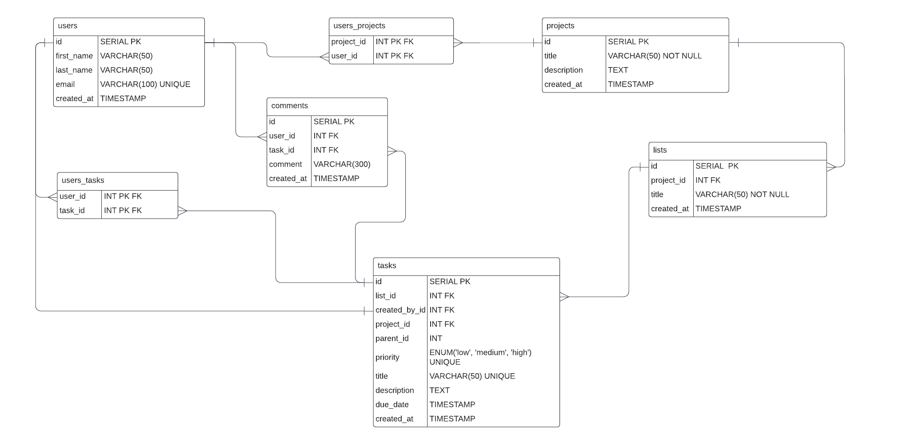

# Fullstack Project Management System
Hi, Welcome to my Fullstack Project Management Systme, I made this project using React/Typescript for the Front-end part and .Net Core for the Back-end part

## Funcionality
* When a user is Logged can do:
    * Create a Project(CRUD)
    * Assign new Users into the project
    * Create List for that Project and Task for that List(CRUD)
    * Inside a Task you can Edit, change the priority, add description, assign User to that task and add Subtask

## Next Features
* Loggin with 3rd parts (google, github)
* Add Comments into a task
* Improve the Design and UX
* Dark Mode

## Front End Project
A modern minimal Vite + React + TypeScript template with pre-configured ESLint (with Airbnb JS/React rules), Prettier

## 📷 Previews

<p align="center">
 
</p>

### Run Locally

Clone the project

[Here](https://github.com/DanielMM161/FullStack-ProjectManagement/archive/refs/heads/main.zip) 

Go to the frontend directory

```bash
  cd frontend
```

Install dependencies

```bash
  npm install / yarn
```

Start the server

```bash
  npm run dev / yarn run dev
```
### 🛠 Tech stack & Open-source libraries
- [React](https://github.com/facebook/react) - version ^18.2.0
- [TypeScript](https://github.com/Microsoft/TypeScript) - version ^4.8.2
- [React Router](https://github.com/remix-run/react-router#readme) - Routes App
- [Redux](https://github.com/reduxjs/redux) - Global State
- [Axios](https://github.com/axios/axios) - Construct the REST APIs: version 1.2.1
- [Mui Components](https://mui.com/material-ui/getting-started/installation/) - Mui Library Components: version ^5.11.8
- [React Notifications Component](https://github.com/teodosii/react-notifications-component) - version ^4.0.1


## Back End Project
This projects has been made with  ASP .NET Core (6), Entity Framework Core, PostgreSQ

### Entity Relationship Diagram


### Main Endpoint
* this is the Main Endpoint: https://backend-myprojectmanagement.azurewebsites.net/api/v1/
If you want to use the api check the swagger docu: [Swagger](https://backend-myprojectmanagement.azurewebsites.net/index.html)

### 🛠 Tech stack & Open-source libraries
- [AutoMapper](https://www.nuget.org/packages/automapper/) - version 12.0.1
- [Naming Convention](https://www.nuget.org/packages/EFCore.NamingConventions) - version 6.0.0
- [JwtBearer](https://www.nuget.org/packages/Microsoft.AspNetCore.Authentication.JwtBearer) - version 6.0.14
- [Entity Framework core](https://www.nuget.org/packages/Microsoft.EntityFrameworkCore) - version 6.0.14
- [Entity Framework Design](https://www.nuget.org/packages/Microsoft.EntityFrameworkCore.Design/) - version 6.0.14
- [Jwt](https://www.nuget.org/packages/System.IdentityModel.Tokens.Jwt/) - version 6.27.0

### Run Locally

Clone the project

[Here](https://github.com/DanielMM161/FullStack-ProjectManagement/archive/refs/heads/main.zip) 

Go to the backend directory

```bash
  cd backend
```

Install dependencies

```bash
  dotnet restore
```

### Important!
You must to provide the appsettings.json and appsettings.Development.json with this structure
and You must to have Postgres Sql Installed in your local machine [PostgreSQL](https://www.postgresql.org/download/)

- appsettings.json
```bash
{
  "Logging": {
    "LogLevel": {
      "Default": "Information",
      "Microsoft.AspNetCore": "Warning"
    }
  },
  "AllowedHosts": "*"
}
```
- appsettings.Development.json:

Start the server
```bash
{
  "Logging": {
    "LogLevel": {
      "Default": "Information",
      "Microsoft.AspNetCore": "Warning",
      "Microsoft.EntityFrameworkCore.Database.Command": "Information"
    }
  },
  "CreateDbAtStart": false,
  "ConnectionStrings": {
    "DefaultConnection": "Host=localhost;Username={your_user_name};Password={your_password};Database=projectManagement",
    "TestConnection": "Host=localhost;Username={your_user_name};Password={your_password};Database=projectManagement"
  },
  "Jwt": {
    "Issuer": "{issuer}",
    "Audience": "",
    "Secret": "{secret_token}",
    "ExpirationHours": 2
  }
}
```

Generate Migration
```bash
  dotnet ef migrations add firstMigration
```

Restore Database: to create the database with the migration
```bash
  dotnet ef database updated
```

Start the server
```bash
  dotnet run
```
